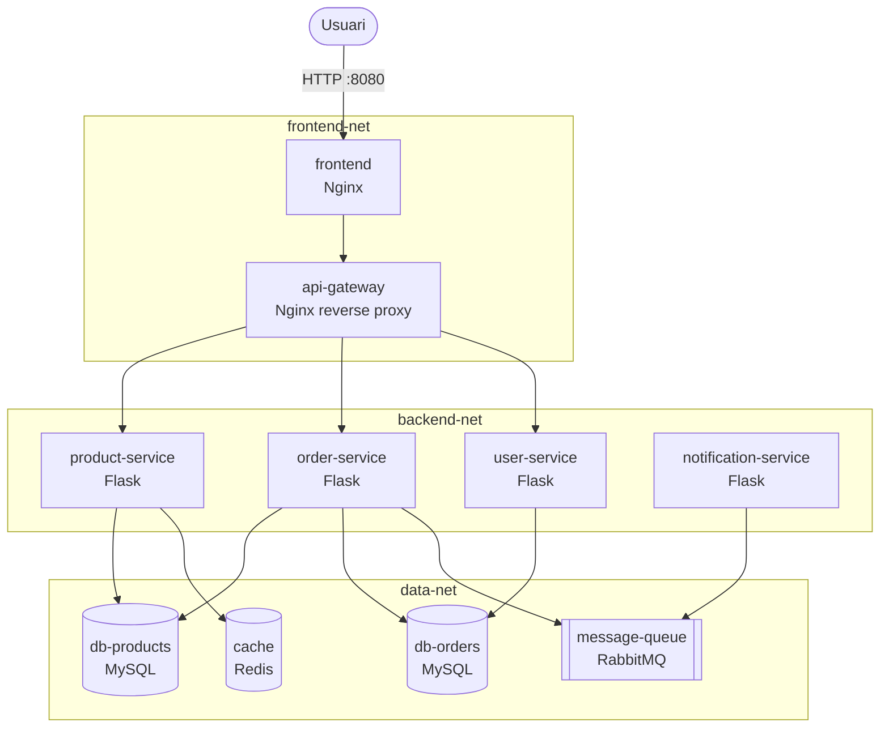

# Fase 1 — Docker Compose: Entorn de Desenvolupament

> **Objectiu**: posar en marxa tots els serveis de ShopMicro en un entorn local mitjançant Docker Compose, amb xarxes internes, volums persistents i healthchecks.

## Índex

1. [Introducció a Docker Compose v2](#1-introducció-a-docker-compose-v2)
2. [Arquitectura de la plataforma](#2-arquitectura-de-la-plataforma)
3. [Estructura del projecte](#3-estructura-del-projecte)
4. [Fitxer docker-compose.yml](#4-fitxer-docker-composeyml)
5. [Codi dels microserveis](#5-codi-dels-microserveis)
6. [Frontend](#6-frontend)
7. [Desplegament i verificació](#7-desplegament-i-verificació)
8. [Conclusions](#8-conclusions)

---

## 1. Introducció a Docker Compose v2

Docker Compose és una eina que permet definir i executar aplicacions multi-contenidor mitjançant un únic fitxer YAML. En lloc de llançar cada contenidor amb `docker run` i els seus paràmetres (ports, volums, xarxes, variables…), tota l'aplicació es descriu en un fitxer `docker-compose.yml` i es gestiona amb comandes com `docker compose up` o `docker compose down`.

### Arquitectura

Compose es basa en tres conceptes principals:

- **Services**: cada microservei o component (un contenidor o diverses rèpliques).
- **Networks**: xarxes virtuals que aïllen o connecten grups de serveis.
- **Volumes**: emmagatzematge persistent que sobreviu al cicle de vida dels contenidors.

### Diferències clau amb `docker run`

| Aspecte | `docker run` | Docker Compose |
|---|---|---|
| Configuració | Paràmetres en línia de comandes | Fitxer YAML versionable |
| Multi-contenidor | Un per un, manualment | Tota la pila a la vegada |
| Dependències | No les gestiona | `depends_on` amb `service_healthy` |
| Reproductibilitat | Difícil (comandes llargues) | Alta (tot al fitxer) |
| Xarxes | Cal crear-les a mà | Es creen automàticament |

En Compose v2 ja no fa falta posar la línia `version:` a l'inici del fitxer, i les comandes són `docker compose` (amb espai), no `docker-compose`.

---

## 2. Arquitectura de la plataforma

### Diagrama d'arquitectura



> 📸 **CAPTURA 1.1** — Diagrama d'arquitectura exportat a PNG des de draw.io o Mermaid Live.

### Decisions de disseny

S'han creat **tres xarxes separades** per seguretat i per il·lustrar la separació de responsabilitats:

- `frontend-net`: usuari → frontend → api-gateway
- `backend-net`: api-gateway ↔ microserveis
- `data-net`: microserveis ↔ bases de dades, cache i cua

Només el frontend exposa port a l'exterior (`8080`). Les BDs no tenen ports publicats, accedint-hi únicament a través de la xarxa interna.

---

## 3. Estructura del projecte

```
shopmicro/
├── docker-compose.yml
├── secrets/
│   ├── db_root_password.txt
│   └── db_user_password.txt
├── frontend/
│   ├── Dockerfile
│   ├── nginx.conf
│   └── html/
│       ├── index.html
│       ├── style.css
│       └── app.js
├── api-gateway/
│   ├── Dockerfile
│   └── nginx.conf
├── product-service/
│   ├── Dockerfile
│   ├── requirements.txt
│   └── app.py
├── order-service/
│   ├── Dockerfile
│   ├── requirements.txt
│   └── app.py
├── user-service/
│   ├── Dockerfile
│   ├── requirements.txt
│   └── app.py
└── notification-service/
    ├── Dockerfile
    ├── requirements.txt
    └── app.py
```

> 📸 **CAPTURA 1.2** — Captura del `tree` o de l'explorador de VS Code mostrant l'estructura.

---

## 4. Fitxer docker-compose.yml

El fitxer complet inclou tots els serveis amb les següents característiques:

- **Imatges base** definides (`image:`) o construïdes localment (`build:`).
- **Variables d'entorn** per a credencials de BD i configuració.
- **Xarxes internes** ben definides (3 xarxes separades).
- **Volums persistents** per a les bases de dades i RabbitMQ.
- **Dependències** entre serveis (`depends_on` amb `condition: service_healthy`).
- **Healthchecks** per als serveis crítics (BD, Redis, RabbitMQ).

[Veure el fitxer docker-compose.yml complet](./docker-compose.yml)

### Exemple de definició d'una BD amb healthcheck

```yaml
db-products:
  image: mysql:8.0
  environment:
    MYSQL_ROOT_PASSWORD_FILE: /run/secrets/db_root_password
    MYSQL_DATABASE: products_db
    MYSQL_USER: appuser
    MYSQL_PASSWORD_FILE: /run/secrets/db_user_password
  secrets:
    - db_root_password
    - db_user_password
  volumes:
    - db_products_data:/var/lib/mysql
  networks:
    - data-net
  healthcheck:
    test: ["CMD", "mysqladmin", "ping", "-h", "localhost"]
    interval: 10s
    timeout: 5s
    retries: 5
```

### Exemple de definició d'un microservei amb dependències

```yaml
product-service:
  build: ./product-service
  environment:
    DB_HOST: db-products
    DB_USER: appuser
    DB_PASSWORD: apppass123
    DB_NAME: products_db
    REDIS_HOST: cache
  networks:
    - backend-net
    - data-net
  depends_on:
    db-products:
      condition: service_healthy
    cache:
      condition: service_healthy
```

---

## 5. Codi dels microserveis

Cada microservei és una aplicació Python molt senzilla amb 2-3 endpoints. El que s'avalua no és la lògica de negoci sinó l'arquitectura de containerització.

### product-service

Exposa `/products` (GET). Implementa el patró **cache-aside** amb Redis:

1. Comprova si la llista de productes està a Redis.
2. Si no hi és, consulta MySQL i guarda el resultat a Redis amb TTL de 60 segons.
3. Retorna la llista amb un camp `source` que indica si ve de `cache` o `db`.

> 📸 **CAPTURA 1.4** — Captura del fitxer `product-service/app.py`.

### user-service

Exposa `/users/register` (POST), `/users/login` (POST) i `/users` (GET). Implementa autenticació amb tokens **JWT** signats amb una clau secreta. Les contrasenyes es guarden hashejades amb SHA-256.

> 📸 **CAPTURA 1.5** — Captura del fitxer `user-service/app.py`.

### order-service

Exposa `/orders` (GET, POST) i `/orders/<id>` (GET). En crear una comanda:

1. Comprova i descompta stock a `db-products`.
2. Crea la comanda a `db-orders`.
3. Publica un missatge a la cua `orders` de RabbitMQ.

> 📸 **CAPTURA 1.6** — Captura del fitxer `order-service/app.py`.

### notification-service

No exposa API. Es connecta a RabbitMQ i consumeix missatges de la cua `orders` indefinidament. Quan rep un missatge, l'imprimeix al log amb un format llegible.

> 📸 **CAPTURA 1.7** — Captura del fitxer `notification-service/app.py`.

---

## 6. Frontend

El frontend és un servidor **Nginx** que serveix HTML/JS/CSS estàtic. El JavaScript del client fa peticions `fetch()` a `/api/*`, que Nginx reenvia a l'api-gateway. Això evita problemes de CORS.

### nginx.conf del frontend

```nginx
events {}
http {
    include       /etc/nginx/mime.types;
    server {
        listen 80;
        location / {
            root /usr/share/nginx/html;
            index index.html;
        }
        location /api/ {
            proxy_pass http://api-gateway:80;
            proxy_set_header Host $host;
        }
    }
}
```

### Funcionalitats demostrades a la web

1. **Registre i login d'usuaris** amb mostra del token JWT.
2. **Catàleg de productes** amb badge que indica si la dada ve de Redis o de MySQL.
3. **Creació de comandes** amb feedback visual.
4. **Historial de comandes** actualitzable.

> 📸 **CAPTURA 1.8** — Captura de la web a `http://localhost:8080` mostrant tots els apartats funcionant.

---

## 7. Desplegament i verificació

### Comandes de desplegament

```bash
# Aixecar tota la stack en segon pla
docker compose up -d --build

# Veure l'estat (tots els serveis han d'estar healthy)
docker compose ps

# Veure logs d'un servei concret
docker compose logs product-service
```

> 📸 **CAPTURA 1.9** — Sortida de `docker compose up -d --build` amb tots els serveis "Built" i "Started".

> 📸 **CAPTURA 1.10** — Sortida de `docker compose ps` amb tots els serveis en estat `Up` o `Healthy`.

### Verificació dels fluxos funcionals

#### Flux 1 — Consulta de productes (cache de Redis)

```bash
curl http://localhost:8080/api/products
# Primera crida: "source": "db"
curl http://localhost:8080/api/products
# Segona crida (en menys de 60s): "source": "cache"
```

> 📸 **CAPTURA 1.11** — Captura de la web mostrant primer "Origen: db-products (MySQL)" i després "Origen: Redis (cache)".

#### Flux 2 — Registre i login d'usuari

```bash
curl -X POST http://localhost:8080/api/users/register \
  -H "Content-Type: application/json" \
  -d '{"username":"axel","password":"1234"}'

curl -X POST http://localhost:8080/api/users/login \
  -H "Content-Type: application/json" \
  -d '{"username":"axel","password":"1234"}'
# Retorna un JWT
```

> 📸 **CAPTURA 1.12** — Captura de la web mostrant "Login correcte" amb el token JWT.

#### Flux 3 — Creació de comanda i notificació via RabbitMQ

```bash
curl -X POST http://localhost:8080/api/orders \
  -H "Content-Type: application/json" \
  -d '{"product_id":1,"quantity":2}'

docker compose logs notification-service
# [NOTIFICACIÓ] Comanda #1 creada: 2 x Portàtil...
```

> 📸 **CAPTURA 1.13** — Captura de la web mostrant "Comanda creada".

> 📸 **CAPTURA 1.14** — Logs de `notification-service` mostrant el missatge de notificació rebut de RabbitMQ.

---

## 8. Conclusions

### Què s'ha aconseguit

- Tots els 9 serveis de la plataforma containeritzats correctament.
- Comunicació entre serveis a través de xarxes overlay separades.
- Volums persistents per a les BDs i la cua RabbitMQ.
- Healthchecks que asseguren que els microserveis no arrencen abans que la BD estigui llesta.
- Tres fluxos funcionals demostrables des de la web.

### Problemes trobats i resolts

Durant el desenvolupament es va detectar que els microserveis Python rebien errors `Access denied` en connectar a MySQL. Després d'investigar, es va veure que els fitxers de secrets generats amb `echo` incloïen un caràcter `\n` final, que s'incloïa a la contrasenya de l'usuari `appuser` que MySQL creava al primer arrencament. Com que MySQL només llegeix les credencials a la primera arrencada (i les guarda al volum), va ser necessari:

1. Regenerar els fitxers amb `printf` (sense `\n`).
2. Esborrar els volums amb `docker compose down -v` perquè MySQL es tornés a inicialitzar.

Aquesta experiència il·lustra una de les **trampes habituals** quan es treballa amb imatges oficials de bases de dades a Docker.

### Què s'ha après

- Funcionament del fitxer `docker-compose.yml` i de la sintaxi YAML.
- Diferència entre `image:` (descarregar de Docker Hub) i `build:` (construir amb un Dockerfile).
- Importància dels `healthcheck` per evitar errors d'arrencada prematura.
- Comportament del cicle de vida de les BD i els seus volums.
- Patró cache-aside amb Redis i missatgeria asíncrona amb RabbitMQ.

---

*Anar a la [Fase 2 — Docker Swarm](./FASE2.md) ➡️*