# Kubernetes: Migració i Gestió Avançada

## Introducció

En aquesta fase es migra la plataforma ShopMicro de Docker Swarm a Kubernetes. S'utilitza **Minikube** com a entorn local amb Kubernetes v1.30.0, que permet simular un clúster real en un sol ordinador fent servir Docker com a backend.

L'objectiu és reproduir tota la funcionalitat de les fases anteriors (alta disponibilitat, secrets, rolling updates) però amb les eines i conceptes propis de Kubernetes: Deployments, Services, ConfigMaps, Secrets, Namespaces i Probes.

### Estructura del projecte

```
ShopMicro-FASE4/
├── api-gateway/                  ← Dockerfile i config Nginx del gateway
├── frontend/                     ← Codi HTML/JS i Dockerfile del frontend
├── product-service/              ← Microservei Python (productes)
├── order-service/                ← Microservei Python (comandes)
├── user-service/                 ← Microservei Python (usuaris/JWT)
├── notification-service/         ← Microservei Python (consumidor RabbitMQ)
├── secrets/                      ← Heretat de Fase 1
├── k8s/                          ← Manifests de Kubernetes
│   ├── namespace/
│   ├── secrets/
│   ├── configmaps/
│   ├── generated/                ← Deployments + PVCs, base generada per kompose
│   └── services/                 ← Services interns + frontend, LoadBalancer
├── docker-compose.yml            ← Heretat, entorn local sense K8s
├── docker-compose-k8s.yml        ← Plantilla d'entrada per a kompose
├── capturas/fase4/               ← Captures de pantalla
└── fase4.md                      ← Aquest document
```

> **Nota sobre els fitxers Compose:** El `docker-compose.yml` és una còpia del de la Fase 1, mantinguda per poder aixecar l'entorn local sense Kubernetes si cal fer proves ràpides. El `docker-compose-k8s.yml` és una versió simplificada que es va usar com a entrada per a `kompose convert` i **no es desplega mai**: només va servir per generar la base dels manifests de `k8s/generated/`.

---

## Taula comparativa Swarm vs Kubernetes

# Comparativa Docker Swarm vs Kubernetes
 
A partir de l'experiència adquirida amb les Fases 2 i 3 (Docker Swarm) i el coneixement teòric de Kubernetes, s'ha preparat la següent comparativa centrada específicament en els aspectes rellevants per al cas d'ús ShopMicro.
 
---
 
## Taula comparativa
 
| Aspecte | Docker Swarm (Fases 2-3) | Kubernetes (Fase 4) |
|---|---|---|
| **Unitat de desplegament** | Servei (`docker service`) | Pod (un o més contenidors) |
| **Definició** | Un sol fitxer `docker-stack.yml` | Manifests YAML separats per recurs (`Deployment`, `Service`, `Secret`, `ConfigMap`...) |
| **Sintaxi** | Sintaxi propietària de Docker | YAML estandarditzat per la CNCF |
| **Escalat manual** | `docker service scale name=N` | `kubectl scale deployment name --replicas=N` |
| **Escalat automàtic** | No nadiu | `HorizontalPodAutoscaler` (HPA) basat en CPU/RAM/mètriques |
| **Self-healing** | Sí, amb `restart_policy: on-failure` | Sí, automàtic via `liveness probes` |
| **Health checks** | `healthcheck:` al stack | Probes separades: `livenessProbe` (reinicia) i `readinessProbe` (treu de servei) |
| **Rolling updates** | `update_config` amb `parallelism` i `order` | Deployment strategy: `RollingUpdate` amb `maxSurge` i `maxUnavailable` |
| **Rollback** | `docker service rollback` | `kubectl rollout undo deployment/name` |
| **Gestió de secrets** | Docker Secrets nadius (Fase 3) | Secret objects (Base64, no xifrats per defecte!) |
| **Configuració** | Variables d'entorn al `environment:` | ConfigMaps separats, muntables com a fitxers o `env` |
| **Networking** | Overlay automàtic, routing mesh integrat | Plugins externs (Calico, Flannel, Cilium) + Services + Ingress |
| **Exposició al món** | `ports: 8080:80` (routing mesh tots els nodes) | Service tipus `NodePort`, `LoadBalancer` o `Ingress` |
| **DNS intern** | Per nom de servei al stack | Per nom de servei al namespace (`<service>.<namespace>.svc.cluster.local`) |
| **Aïllament lògic** | Stacks (`shopmicro_*`) | Namespaces (`shopmicro`) |
| **Aïllament de xarxa** | Xarxes overlay separades (Fase 3) | NetworkPolicies (a nivell de Pod) |
| **Persistència** | Volums Docker locals al node | PersistentVolumes + PersistentVolumeClaims + StorageClasses |
| **TLS entre nodes** | Automàtic (mTLS amb CA interna) | Configurable (kube-apiserver TLS, etcd TLS) |
| **Complexitat operativa** | Baixa — 5 conceptes essencials | Alta — desenes de tipus de recurs |
| **Corba d'aprenentatge** | Suau (1 setmana per dominar el bàsic) | Empinada (mesos per dominar realment) |
| **Ecosistema** | Limitat | Molt ampli: Helm, Operators, Service Mesh (Istio/Linkerd), GitOps (ArgoCD) |
| **Comunitat i futur** | En manteniment, ja no creix | Estàndard de facto de la indústria, en creixement constant |
 
---
 
## Anàlisi qualitatiu aplicat a ShopMicro
 
### Escalat
 
A la Fase 2 vam escalar `product-service` de 2 a 4 rèpliques amb `docker service scale`. A Kubernetes, l'equivalent és:
 
```bash
kubectl scale deployment product-service --replicas=4 -n shopmicro
```
 
La diferència clau és que Kubernetes pot fer escalat automàtic amb HPA, basant-se en mètriques de CPU/RAM. Per exemple, escalar `product-service` automàticament quan la CPU superi el 70%. Swarm no té aquesta capacitat de manera nadiua.
 
---
 
### Self-healing
 
Tots dos sistemes reinicien automàticament els contenidors caiguts. La diferència és la granularitat:
 
- **Swarm:** si el procés principal del contenidor mor, el reinicia. No detecta si el procés està viu però no respon.
- **Kubernetes:** amb `livenessProbe` pots configurar comprovacions HTTP/TCP/exec que detecten si el servei està realment funcionant, no només si el procés està viu. Per exemple, una crida a `/health` que retorni `200 OK`.
Per al cas de ShopMicro, això és especialment útil per als microserveis Python que poden quedar bloquejats sense morir.
 
---
 
### Rolling updates
 
A la Fase 2 vam configurar:
 
```yaml
update_config:
  parallelism: 1
  delay: 10s
  order: start-first
```
 
L'equivalent a Kubernetes és:
 
```yaml
strategy:
  type: RollingUpdate
  rollingUpdate:
    maxSurge: 1        # quants pods nous es poden crear de més
    maxUnavailable: 0  # zero downtime
```
 
Kubernetes ofereix més control granular i, sobretot, històric d'actualitzacions amb `kubectl rollout history`, cosa que Swarm no té.
 
---
 
### Gestió de secrets
 
A la Fase 3 vam migrar tot a Docker Secrets. Una sorpresa: els secrets de Kubernetes són només codificats en Base64, **no xifrats**. Per a un xifrat real cal configurar Encryption at Rest d'etcd o utilitzar solucions externes com Sealed Secrets, Vault o External Secrets Operator.
 
Tot i això, l'aïllament a nivell de Namespace + RBAC de Kubernetes és més fi que el dels Docker Secrets, ja que es pot controlar quins usuaris/serveis poden llegir cada secret.
 
---
 
### Networking
 
La diferència més gran. En Swarm, el routing mesh fa que el port `8080` estigui disponible en qualsevol IP del clúster (vam veure-ho a la Fase 2). En Kubernetes hi ha tres opcions:
 
- **ClusterIP:** només accessible dins del clúster (per a microserveis interns).
- **NodePort:** exposat a un port a tots els nodes.
- **LoadBalancer:** requereix un LoadBalancer extern (cloud) o una solució local com `minikube tunnel`.
Per a aquesta pràctica s'utilitzarà `LoadBalancer` + `minikube tunnel` perquè simula millor un entorn productiu.
 
---
 
### Complexitat operativa
 
Aquesta és l'única àrea on Swarm clarament guanya. Per al cas d'ús de ShopMicro:
 
- **Swarm:** 1 fitxer `docker-stack.yml` amb ~250 línies. 5 comandes essencials per gestionar-ho tot (`docker stack deploy/rm/services/ps`, `docker service scale`).
- **Kubernetes:** 10+ fitxers YAML separats per recurs i microservei. ~20 comandes habituals per a operació diària. Concepte clau: cada recurs (`Deployment`, `Service`, `Secret`, etc.) és un fitxer separat.
Aquesta complexitat es justifica en entorns de producció reals, però per a una empresa petita amb 5-10 microserveis, Swarm pot ser suficient i molt més operable.
 
---
 
## Conclusió de la comparativa
 
Per al cas concret de ShopMicro, Kubernetes ofereix:
 
**Avantatges:**
- Escalat automàtic real (HPA), molt útil quan hi ha pics de tràfic.
- Probes més granulars per detectar problemes reals als microserveis.
- Ecosistema enorme (Helm, ArgoCD, Istio, etc.) que cobreix qualsevol cas avançat.
- Estàndard de la indústria — el coneixement és transferible a qualsevol cloud.
**Inconvenients:**
- Complexitat operativa molt més alta.
- Secrets per defecte només en Base64 (no xifrats).
- Corba d'aprenentatge més pronunciada.
La decisió de migrar de Swarm a Kubernetes està justificada quan l'equip és prou gran per absorbir la complexitat operativa, quan es necessiten funcionalitats avançades com escalat automàtic, o quan es vol portabilitat a clouds públics.

---

## Instal·lar Minikube i kubectl a WSL

### Verificar prerequisits

Abans d'instal·lar res, verifiquem que Docker funciona correctament a WSL:

```bash
docker --version
docker ps
```

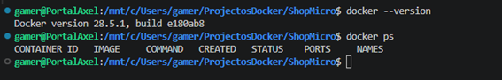

### Instal·lar kubectl

`kubectl` és la CLI oficial per interactuar amb qualsevol clúster Kubernetes. Cal instal·lar-la separadament de Minikube:

```bash
# Descarregar la última versió estable
curl -LO "https://dl.k8s.io/release/$(curl -L -s \
  https://dl.k8s.io/release/stable.txt)/bin/linux/amd64/kubectl"

# Donar permisos i moure a /usr/local/bin
sudo install -o root -g root -m 0755 kubectl /usr/local/bin/kubectl

# Verificar
kubectl version --client
```

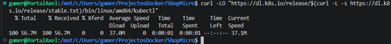
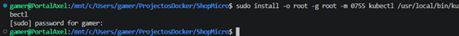

### Instal·lar Minikube

```bash
# Descarregar Minikube
curl -LO https://storage.googleapis.com/minikube/releases/latest/minikube-linux-amd64

# Instal·lar
sudo install minikube-linux-amd64 /usr/local/bin/minikube
rm minikube-linux-amd64

# Verificar
minikube version
```

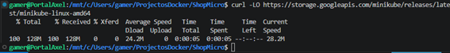
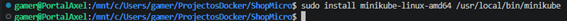

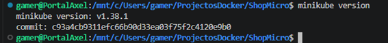

### Arrencar el clúster

Arrenquem Minikube amb el driver Docker, que és l'opció òptima per a WSL ja que aprofita el Docker que ja tenim instal·lat:

```bash
minikube start \
  --driver=docker \
  --cpus=2 \
  --memory=4096 \
  --kubernetes-version=v1.30.0
```

Cada paràmetre té el seu propòsit:

- `--driver=docker`: usa Docker com a backend en lloc de virtualitzar una màquina nova.
- `--cpus=2`: assigna 2 vCPUs al clúster.
- `--memory=4096`: assigna 4 GB de RAM.
- `--kubernetes-version=v1.30.0`: fixa la versió de Kubernetes que demana l'enunciat.

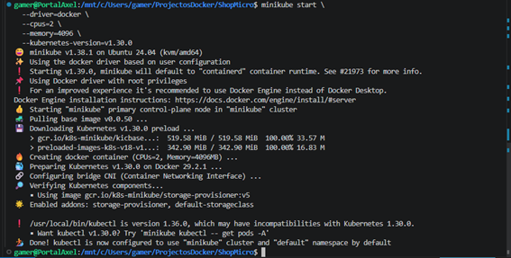

### Verificar el clúster

```bash
# Estat global
minikube status

# Nodes del clúster (1 node perquè és Minikube)
kubectl get nodes

# Components interns (han d'estar tots Running)
kubectl get pods -n kube-system
```

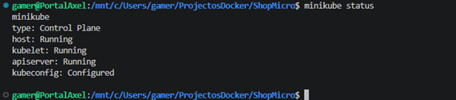

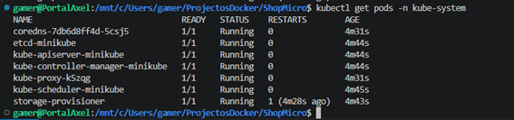

### Activar el dashboard

```bash
minikube addons enable dashboard
minikube addons enable metrics-server
```

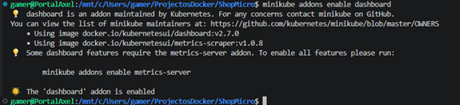
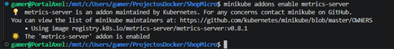


Per obrir-lo:

```bash
minikube dashboard
```

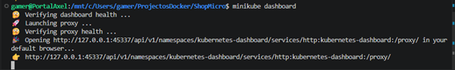
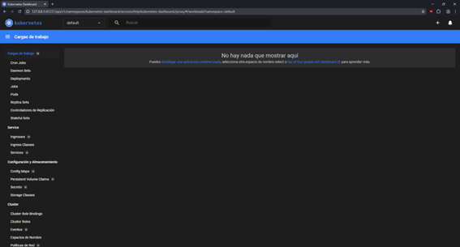
---

## Crear el namespace shopmicro

Un **namespace** a Kubernetes és una carpeta lògica per agrupar i aïllar recursos. Tot el que es crea per a ShopMicro (Deployments, Services, Secrets, ConfigMaps) viurà dins del namespace `shopmicro`, separat del sistema de Kubernetes (`kube-system`) i d'altres projectes.

### Manifest

[`k8s/namespace/namespace.yaml`](k8s/namespace/namespace.yaml)

### Aplicar i verificar

```bash
kubectl apply -f k8s/namespace/namespace.yaml

# Llistar tots els namespaces
kubectl get namespaces

# Veure detalls del nostre
kubectl describe namespace shopmicro
```

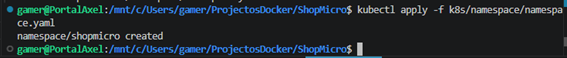
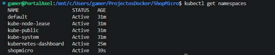
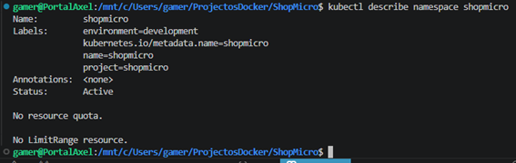

---

## Crear els manifests YAML

### A-Preparar el `docker-compose-k8s.yml` per a kompose

L'eina **kompose** converteix un fitxer `docker-compose.yml` en manifests de Kubernetes automàticament. El problema és que el `docker-stack.yml` de la Fase 3 fa servir sintaxi pròpia de Docker Swarm (`secrets: external: true`, `deploy:`, `depends_on: condition: service_healthy`...) que kompose no sap traduir.

Per això es va crear el fitxer 📄 [`docker-compose-k8s.yml`](docker-compose-k8s.yml): una versió simplificada del Compose original, pensada exclusivament perquè kompose pugui llegir-la. **Aquest fitxer no es desplega mai a Kubernetes**, és només una plantilla d'entrada per a la conversió automàtica.

Els canvis respecte al `docker-compose.yml` original:

| Què s'ha eliminat | Per què |
|---|---|
| `secrets:` global i per servei | Kompose no suporta Docker Secrets |
| `healthcheck:` | Kompose no els tradueix correctament a probes |
| `depends_on:` | Kubernetes no els suporta; els pods arrenquen en paral·lel |
| `deploy:` (replicas, constraints...) | Sintaxi exclusiva de Swarm |
| `container_name:` | Kubernetes no el fa servir |
| `MYSQL_ROOT_PASSWORD_FILE` → `MYSQL_ROOT_PASSWORD` | Kompose generarà variables d'entorn simples |

### B-Instal·lar kompose i convertir

```bash
# Descarregar kompose
curl -L https://github.com/kubernetes/kompose/releases/download/v1.34.0/kompose-linux-amd64 \
  -o kompose

# Permisos i instal·lació
chmod +x kompose
sudo mv kompose /usr/local/bin/kompose

# Verificar
kompose version
```

```bash
# Crear carpeta per als manifests generats
mkdir -p k8s/generated

# Convertir
kompose convert -f docker-compose-k8s.yml --out k8s/generated/
```

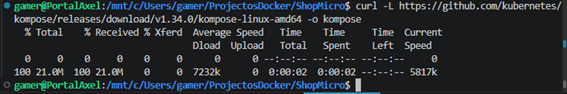
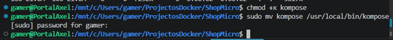
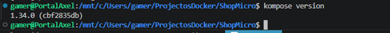


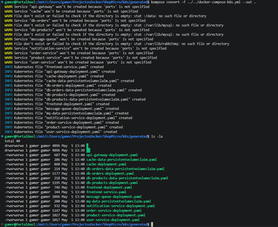


Kompose ha generat la base dels Deployments i els PersistentVolumeClaims. A continuació s'han ajustat manualment per afegir tot el que kompose no pot traduir (probes, secrets, configmaps, init containers).

### C-Secrets

Els **Secrets** de Kubernetes són l'equivalent als Docker Secrets de la Fase 3. Emmagatzemen dades sensibles que Kubernetes codifica automàticament en Base64 i que els pods llegeixen com a variables d'entorn sense que apareguin mai en clar als Deployments.

> **Diferència respecte a la Fase 3:** A Docker Swarm els secrets es muntaven com a fitxers a `/run/secrets/`. A Kubernetes s'injecten directament com a variables d'entorn mitjançant `secretKeyRef`. Per això els microserveis Python funcionen correctament: el codi ja tenia el `fallback_env` a la funció `read_secret()` que llegeix de variables d'entorn si no troba el fitxer.

Els 3 fitxers de secrets:

- [`k8s/secrets/db-secrets.yaml`](k8s/secrets/db-secrets.yaml) — credencials de MySQL (root i appuser).
- [`k8s/secrets/jwt-secret.yaml`](k8s/secrets/jwt-secret.yaml) — clau per signar tokens JWT.
- [`k8s/secrets/rabbitmq-secrets.yaml`](k8s/secrets/rabbitmq-secrets.yaml) — credencials de RabbitMQ.

### D-ConfigMap

El **ConfigMap** centralitza tota la configuració no sensible: noms de hosts, noms de bases de dades i usuaris. Separar-ho dels Secrets permet canviar configuració sense tocar les credencials i viceversa.

 [`k8s/configmaps/app-config.yaml`](k8s/configmaps/app-config.yaml)

### Part E — PersistentVolumeClaims

Els PVCs són l'equivalent als `volumes:` de Docker Compose. Reserven espai d'emmagatzematge persistent per a les bases de dades i la cua de missatges, de manera que les dades sobreviuen si un pod es reinicia.

S'han creat 4 PVCs de 100MB cadascun (suficient per a l'entorn de desenvolupament de Minikube):

- [`k8s/generated/db-products-data-persistentvolumeclaim.yaml`](k8s/generated/db-products-data-persistentvolumeclaim.yaml)
- [`k8s/generated/db-orders-data-persistentvolumeclaim.yaml`](k8s/generated/db-orders-data-persistentvolumeclaim.yaml)
- [`k8s/generated/cache-data-persistentvolumeclaim.yaml`](k8s/generated/cache-data-persistentvolumeclaim.yaml)
- [`k8s/generated/mq-data-persistentvolumeclaim.yaml`](k8s/generated/mq-data-persistentvolumeclaim.yaml)

### F-Deployments

Cada microservei té el seu Deployment a la carpeta `k8s/generated/`. Els ajustos manuals més importants respecte als fitxers generats per kompose han estat:

**1. Variables d'entorn des de Secrets i ConfigMaps**

En lloc de posar els valors en clar al Deployment, es referencien des dels recursos corresponents:

```yaml
env:
- name: DB_HOST
  valueFrom:
    configMapKeyRef:      # ← valor no sensible → ConfigMap
      name: app-config
      key: DB_PRODUCTS_HOST
- name: DB_PASSWORD
  valueFrom:
    secretKeyRef:         # ← valor sensible → Secret
      name: db-credentials
      key: user-password
```

**2. Readiness i Liveness Probes**

S'han afegit probes a tots els microserveis. Kubernetes les usa per saber si un pod està llest per rebre tràfic (`readinessProbe`) i si segueix funcionant correctament (`livenessProbe`):

```yaml
readinessProbe:
  httpGet: { path: /health, port: 5000 }
  initialDelaySeconds: 10
  periodSeconds: 5
livenessProbe:
  httpGet: { path: /health, port: 5000 }
  initialDelaySeconds: 30
  periodSeconds: 10
```

Per a les bases de dades i Redis, on no hi ha API HTTP, s'usen probes de tipus `exec`:

```yaml
readinessProbe:
  exec:
    command: ["mysqladmin", "ping", "-h", "localhost"]
  initialDelaySeconds: 20
  periodSeconds: 10
```

**3. InitContainers al `api-gateway` i al `frontend`**

Kubernetes arrenca tots els pods en paral·lel (no hi ha `depends_on`). Per evitar que l'`api-gateway` arrenqui abans que els microserveis estiguin disponibles per DNS, s'ha afegit un `initContainer` que espera fins que els noms de host es resolen correctament:

```yaml
initContainers:
- name: wait-for-microservices
  image: busybox:1.36
  command:
    - sh
    - -c
    - |
      until nslookup product-service.shopmicro.svc.cluster.local; do
        echo "DNS no resolt encara, esperant 2s..."
        sleep 2
      done
      ...
```

Un `initContainer` és un contenidor especial que s'executa **abans** del contenidor principal i ha d'acabar correctament per a que el pod principal arrenqui. En aquest cas, el `busybox` fa `nslookup` en bucle fins que el DNS de Kubernetes resol el nom del servei, cosa que indica que el Service i els pods corresponents estan creats.

El mateix patró s'aplica al `frontend`, que espera que l'`api-gateway` estigui disponible per DNS abans d'arrencar Nginx.

**4. Estratègia de RollingUpdate**

Als microserveis amb 2 rèpliques s'ha configurat la mateixa estratègia de zero downtime que a Swarm:

```yaml
strategy:
  type: RollingUpdate
  rollingUpdate:
    maxSurge: 1        # pot crear 1 pod extra durant l'actualització
    maxUnavailable: 0  # mai pot haver menys rèpliques de les definides
```

#### Llistat dels Deployments

**Bases de dades i infraestructura:**

- [`k8s/generated/db-products-deployment.yaml`](k8s/generated/db-products-deployment.yaml) — MySQL per a productes.
- [`k8s/generated/db-orders-deployment.yaml`](k8s/generated/db-orders-deployment.yaml) — MySQL per a comandes i usuaris.
- [`k8s/generated/cache-deployment.yaml`](k8s/generated/cache-deployment.yaml) — Redis amb probes via `redis-cli ping`.
- [`k8s/generated/message-queue-deployment.yaml`](k8s/generated/message-queue-deployment.yaml) — RabbitMQ amb credencials des de Secrets.

**Microserveis Python:**

- [`k8s/generated/product-service-deployment.yaml`](k8s/generated/product-service-deployment.yaml) — 2 rèpliques, RollingUpdate, probes HTTP a `/health`.
- [`k8s/generated/order-service-deployment.yaml`](k8s/generated/order-service-deployment.yaml) — 2 rèpliques, accés a 2 BDs i RabbitMQ.
- [`k8s/generated/user-service-deployment.yaml`](k8s/generated/user-service-deployment.yaml) — 2 rèpliques, JWT secret injectat.
- [`k8s/generated/notification-service-deployment.yaml`](k8s/generated/notification-service-deployment.yaml) — 1 rèplica (consumidor pur), sense probes HTTP perquè no exposa API.

**Gateway i frontend:**

- [`k8s/generated/api-gateway-deployment.yaml`](k8s/generated/api-gateway-deployment.yaml) — 2 rèpliques, init container que espera els microserveis, probes TCP al port 80.
- [`k8s/generated/frontend-deployment.yaml`](k8s/generated/frontend-deployment.yaml) — 2 rèpliques, init container que espera l'`api-gateway`, probes HTTP al port 80.

### G-Services

Un **Service** de Kubernetes és un punt d'entrada estable per a un grup de pods. Com que els pods tenen IPs que canvien cada vegada que moren i es recreen, el Service proporciona un nom DNS fix i una IP virtual que sempre apunta als pods correctes.

Tots els Services interns són de tipus **ClusterIP** (per defecte), accessible només dins del clúster. L'únic Service accessible des de fora és el del `frontend`, de tipus **LoadBalancer**:

**Services interns (ClusterIP):**

- [`k8s/services/api-gateway-service.yaml`](k8s/services/api-gateway-service.yaml) — port 80.
- [`k8s/services/product-service-service.yaml`](k8s/services/product-service-service.yaml) — port 5000.
- [`k8s/services/order-service-service.yaml`](k8s/services/order-service-service.yaml) — port 5000.
- [`k8s/services/user-service-service.yaml`](k8s/services/user-service-service.yaml) — port 5000.
- [`k8s/services/cache-service.yaml`](k8s/services/cache-service.yaml) — port 6379 (Redis).
- [`k8s/services/db-products-service.yaml`](k8s/services/db-products-service.yaml) — port 3306 (MySQL).
- [`k8s/services/db-orders-service.yaml`](k8s/services/db-orders-service.yaml) — port 3306 (MySQL).
- [`k8s/services/message-queue-service.yaml`](k8s/services/message-queue-service.yaml) — ports 5672 (AMQP) i 15672 (UI de gestió).

**Service extern (LoadBalancer):**

- [`k8s/services/frontend-service.yaml`](k8s/services/frontend-service.yaml) — port 8080 (extern) → 80 (intern).

El tipus `LoadBalancer` és l'equivalent al `ports: "8080:80"` de Docker Compose. A Minikube requereix executar `minikube tunnel` perquè assigni una IP externa al Service (en un cloud real com AWS o GCP, un LoadBalancer extern s'assignaria automàticament).

---

## kubectl apply — Verificar pods Running — minikube tunnel

### Aplicar tots els manifests

L'ordre d'aplicació és important: el namespace ha d'existir abans que qualsevol altre recurs, i els Secrets i ConfigMaps han d'existir abans que els Deployments els necessitin.

```bash
# 1r: el namespace
kubectl apply -f k8s/namespace/

# 2n: secrets i configmaps
kubectl apply -f k8s/secrets/
kubectl apply -f k8s/configmaps/

# 3r: deployments, PVCs i services
kubectl apply -f k8s/generated/
kubectl apply -f k8s/services/
```

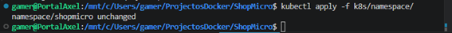
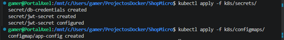
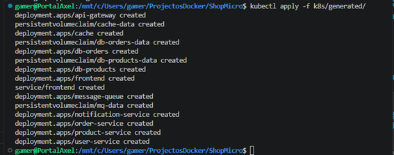
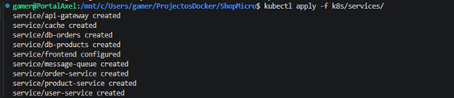

### Verificar que tots els pods estan Running

```bash
# Veure tots els pods del namespace
kubectl get pods -n shopmicro -o wide
```

Cal esperar entre 1 i 3 minuts fins que tots els pods estiguin `1/1 Running`. Les bases de dades i RabbitMQ tarden més perquè els seus `initialDelaySeconds` de les probes són majors.

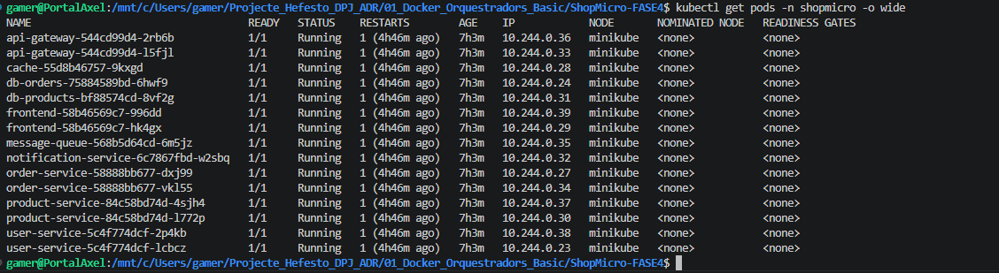

### Verificar tots els Services

```bash
kubectl get services -n shopmicro
```

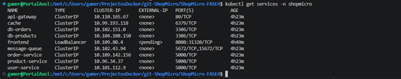

### Detalls del product-service

```bash
kubectl describe deployment product-service -n shopmicro
```

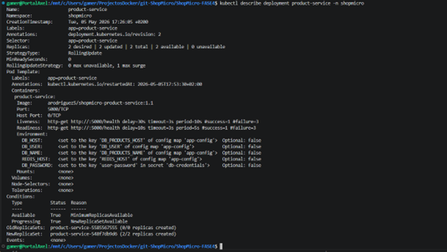

### Vista global de tots els recursos

```bash
kubectl get all -n shopmicro
```

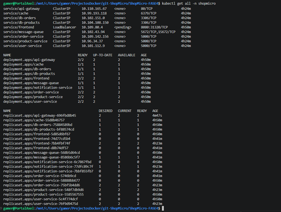

### Obrir el túnel i accedir a la web

En una terminal a part (no la tanquis mentre fas proves):

```bash
minikube tunnel
```

Ara obre el navegador a `http://localhost:8080`.

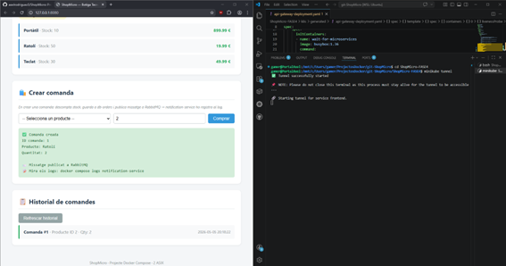

---

## Rolling update — product-service :1.1 → :1.2

### Modificació del codi

Per fer el rolling update visible, s'ha afegit un endpoint `/version` al `product-service` que retorna la versió activa. Això permet verificar de manera objectiva quina versió s'està executant dins dels pods, no només quina imatge diu el manifest.

Canvis a [`product-service/app.py`](product-service/app.py):

```python
VERSION = "1.2"                      # ← NOU: constant de versió

@app.route('/version')               # ← NOU: endpoint de versió
def version():
    return jsonify({"service": "product-service", "version": VERSION})

if __name__ == '__main__':
    print(f"[startup] Product Service v{VERSION} starting...", flush=True)  # ← NOU
    init_db()
    app.run(host='0.0.0.0', port=5000)
```

### Construir i pujar la nova imatge

```bash
docker build -t arodriguez5/shopmicro-product-service:1.2 ./product-service
docker push arodriguez5/shopmicro-product-service:1.2
```

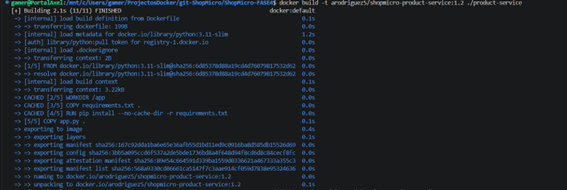
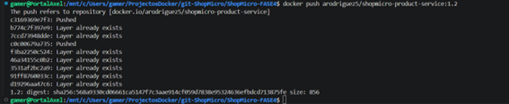

### Actualitzar el manifest

Al fitxer [`k8s/generated/product-service-deployment.yaml`](k8s/generated/product-service-deployment.yaml), canvi de la imatge:

```yaml
# Abans:
image: arodriguez5/shopmicro-product-service:1.1
# Després:
image: arodriguez5/shopmicro-product-service:1.2
```

### Disparar el rolling update

S'obren tres terminals per veure el procés en temps real.

**Terminal 1** — observador de pods:

```bash
kubectl get pods -n shopmicro -l app=product-service -w
```

**Terminal 2** — estat del rollout:

```bash
kubectl rollout status deployment/product-service -n shopmicro
```

**Terminal 3** — aplicar el canvi:

```bash
kubectl apply -f k8s/generated/product-service-deployment.yaml
```

Gràcies a `maxSurge: 1` i `maxUnavailable: 0`, Kubernetes segueix aquest procés:

1. Crea 1 pod nou amb la imatge `:1.2` (ara hi ha 3 pods: 2 antics + 1 nou).
2. Espera que el pod nou passi la `readinessProbe` (HTTP GET a `/health`).
3. Quan el pod nou és `Ready`, elimina 1 pod antic.
4. Repeteix fins que tots els pods siguin de la versió nova.

En cap moment hi ha menys de 2 pods disponibles → **zero downtime**.

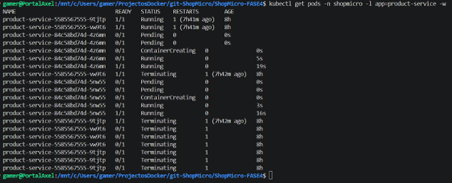


### Verificar la nova versió

```bash
# Confirmar la imatge activa
kubectl describe deployment product-service -n shopmicro | grep Image

# Cridar l'endpoint /version des del api-gateway
kubectl exec -n shopmicro deployment/api-gateway -- \
  wget -qO- http://product-service:5000/version

```


### Històric del rollout

Una característica que Docker Swarm no té i Kubernetes sí és l'històric de desplegaments:

```bash
kubectl rollout history deployment/product-service -n shopmicro
```

Si calgués tornar a la versió anterior, seria tan senzill com:

```bash
kubectl rollout undo deployment/product-service -n shopmicro
```

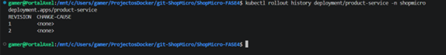

---

## Provar els 3 fluxos funcionals

Un cop desplegada tota l'arquitectura a Kubernetes, es verifiquen els mateixos tres fluxos definits a l'apartat 2.3 de l'enunciat.

### Consulta de productes amb cache Redis

**Procediment:**

1. Accedir a `http://localhost:8080` (exposat via `minikube tunnel`).
2. Clicar **"Carregar productes"** per primera vegada → la cache de Redis és buida, el `product-service` consulta `db-products` directament.
3. Clicar **"Carregar productes"** una segona vegada dins dels 60 segons → el `product-service` troba les dades a Redis i les retorna des de la cache.

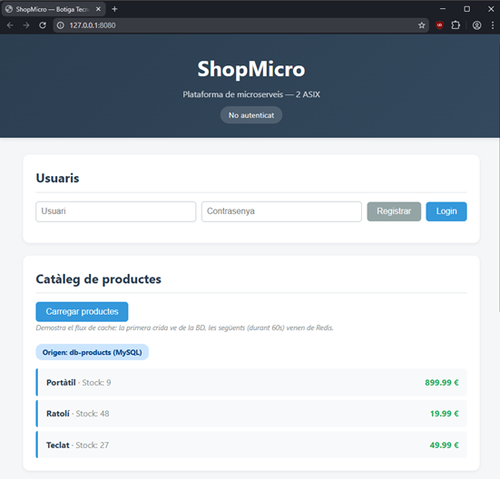

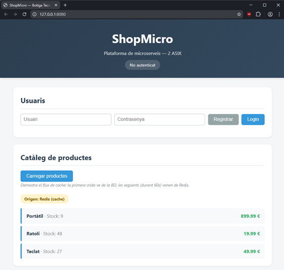

**Verificació amb logs:**

```bash
kubectl logs -n shopmicro -l app=product-service --tail=10
```

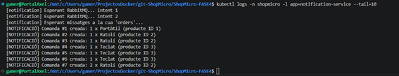

### Creació de comanda amb missatge asíncron a RabbitMQ

**Procediment:**

1. A la secció "Crear comanda", seleccionar un producte i una quantitat.
2. Clicar **"Comprar"** → apareix el missatge "Comanda creada" amb un ID.

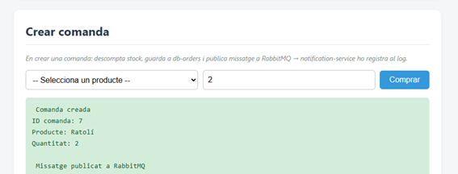

**Verificació del flux complet amb logs:**

```bash
kubectl logs -n shopmicro -l app=notification-service --tail=10
```

Ha d'aparèixer la notificació del missatge consumit de RabbitMQ:

```
[NOTIFICACIÓ] Comanda #N creada: X x Producte (producte ID Y)
```


Això confirma el flux complet: el `order-service` ha publicat el missatge a RabbitMQ i el `notification-service`, que viu en un pod completament separat, l'ha consumit i registrat correctament.

### Self-healing (tolerància a fallades)

A la Fase 2 es va provar aturant Docker en un node worker. A Kubernetes l'equivalent és eliminar un pod manualment i veure com el Deployment el recrea automàticament.

**Terminal 1** — observador en temps real:

```bash
kubectl get pods -n shopmicro -l app=product-service -w
```

**Terminal 2** — eliminar un pod:

```bash
# Obtenir el nom d'un pod
kubectl get pods -n shopmicro -l app=product-service

# Eliminar-lo
kubectl delete pod <nom-del-pod> -n shopmicro
```

A la Terminal 1 es veu la seqüència:

```
NAME                               READY   STATUS        RESTARTS   AGE
product-service-xxx-aaa            1/1     Running       0          10m
product-service-xxx-bbb            1/1     Running       0          10m
product-service-xxx-aaa            1/1     Terminating   0          10m  ← eliminat
product-service-xxx-ccc            0/1     Pending       0          0s   ← Kubernetes crea un nou
product-service-xxx-ccc            0/1     Running       0          3s
product-service-xxx-ccc            1/1     Running       0          13s  ← torna a haver-hi 2
```

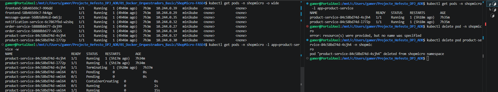

Durant tot el procés, l'altra rèplica continua servint peticions. Es pot verificar tornant al navegador i clicant "Carregar productes" mentre el pod estava `Terminating`: el servei segueix responent sense cap tall.

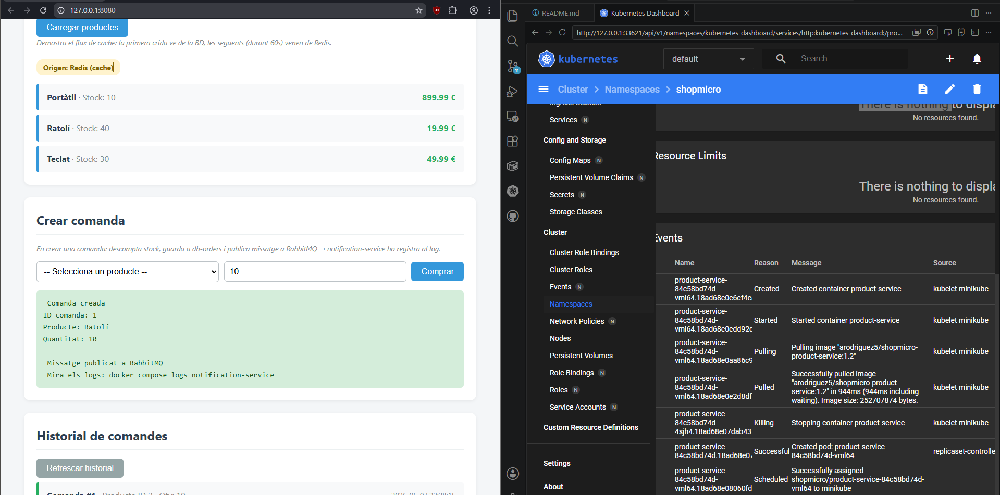

---

## Conclusions de la Fase 4

La migració de Docker Swarm a Kubernetes ha demostrat que els dos sistemes ofereixen funcionalitat conceptualment equivalent (alta disponibilitat, rolling updates, gestió de secrets, networking intern), però amb diferències pràctiques importants:

**Avantatges de Kubernetes observats:**

- **Probes granulars**: les `livenessProbe` i `readinessProbe` permeten detectar no només si un procés ha mort, sinó si ha quedat penjat (cosa que Swarm no pot fer amb el seu `healthcheck` simple).
- **Històric de versions**: `kubectl rollout history` guarda totes les versions desplegades, permetent rollbacks fàcils a qualsevol punt anterior. Swarm només permet rollback a la versió immediatament anterior.
- **Init containers**: el patró d'esperar dependències amb init containers és més net que els `depends_on` de Compose i resol els problemes de DNS que apareixen quan tots els pods arrenquen alhora.
- **Separació clara de responsabilitats**: Secrets per a credencials, ConfigMaps per a configuració, PVCs per a emmagatzematge persistent. A Swarm tot anava al mateix `docker-stack.yml`.

**Desavantatges de Kubernetes observats:**

- **Complexitat operativa**: 30+ fitxers YAML enfront d'un sol `docker-stack.yml`. La corba d'aprenentatge és molt més pronunciada.
- **Secrets en Base64, no xifrats**: cal afegir solucions externes (Sealed Secrets, Vault) per a un xifrat real.
- **Networking més complex**: cal entendre el concepte de Services i el seu DNS intern, mentre que a Swarm el routing mesh era automàtic.