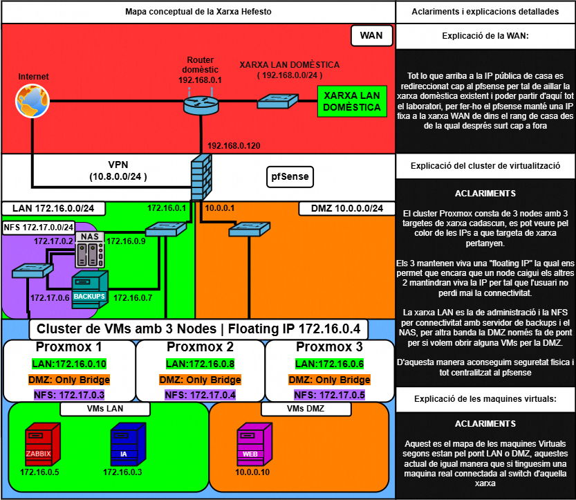

# HEFESTO

Hefesto és el nostre laboratori d'infraestructura IT dissenyat per a la realització de tots el miniprojectes proposats.

Aquest projecte té com a objectiu construir una infraestructura virtual completa que simuli un entorn real d'empresa.

---

# Arquitectura del laboratori

La infraestructura està composta per:

- Servidor físic
- Virtualització
- Firewall pfSense
- Accés remot mitjançant OpenVPN
- Xarxa LAN virtual interna
- Plataforma de virtualització Proxmox
- Serveis desplegats en màquines virtuals

---

# Documentació de la infraestructura

| Document | Descripció |
|---------|------------|
| [Disseny de xarxa](docs/disseny_xarxa.md) | Arquitectura de xarxa del laboratori |

---

# Mini projectes

| Projecte | Descripció |
|---------|------------|
| [Docker Orquestradors](01_Docker_Orquestradors_Basic/README.md) | Desplegament de microserveis amb Docker Compose, Swarm i Kubernetes |
| [Automatització de la configuració](02_Automatització_de_la_Configuració/README.md) | Automatització de configuracions amb Ansible |
| [IDS / IPS](04_IDS_IPS_Suricata/README.md) | Sistema de detecció i prevenció d'intrusions |
| [Monitorització de xarxa](05_Monitorització_de_xarxes_Zabbix/README.md) | Monitorització d'infraestructura amb Zabbix |
| [Virtualització](09_Proxmox/README.md) | Plataforma de virtualització Proxmox |

---

# Tecnologies utilitzades

- pfSense
- OpenVPN
- Proxmox
- Docker
- Kubernetes
- Ansible
- Suricata
- Zabbix

---

# Objectiu del projecte

Aquest laboratori permet:

- Dissenyar una infraestructura de xarxa virtual
- Desplegar serveis de seguretat
- Implementar monitorització
- Automatitzar configuracions
- Documentar un entorn complet d'administració de sistemes

---
# Autors
Projecte realitzat per Axel David Rodriguez i Daniel Pañero Juste del cicle formatiu ASIX del insitut Sapalomera.
